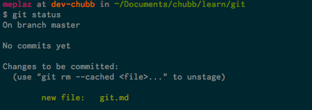
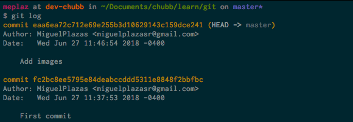

Control de versiones GIT
========================

Conceptos Básicos
=================


El control de versiones es un sistema que registra los cambios realizados sobre un archivo o conjunto de archivos a lo largo del tiempo, de modo que puedas recuperar versiones específicas más adelante.


- Instantáneas no diferencias
- Es local
- Tiene integridad
- Solo añade información

Estados
-------

- Confirmado (commited) : Los datos estan almacenados de forma segura en la base de datos local.
- Modificado (modified) : Se ha modificado el archivo pero todavía no lo has confirmado a tu base de datos. 
- Preparado (staged) : Se ha marcado un archivo modificado en su versión actual para que vaya en tu próxima confirmación.


Secciones
---------
- Directorio de Git (Git direcyory) :  Es la base de datos de objetos para el proyecto. Es lo que se copia cuando se clona un repositorio.
- Directorio de trabajo (working direcry) :  Es una copia de una versión del proyecto.
- Area de preparación (staging area) : Es un archivo que almacena información sober lo que va a ir en la próxima confirmación.

Flujo de trabajo básico de Git
------------------------------
1. Modificar : los archivos en tu directorio de trabajo.
2. Preparar : los archivos, añadiendolos al área de preparación.
3. Confirmar : los cambios, tomando los archivos tal y como están en el área de preparación, y almacena esas instantáneas de manera permanente en el directorio de Git.

Si una versión concreta de un archivo está en el directorio de Git, se considera confirmada (committed). Si ha sufrido cambios desde que se obtuvo del repositorio, pero ha sido añadida al área de preparación, está preparada (staged). Y si ha sufrido cambios desde que se obtuvo del repositorio, pero no se ha preparado, está modificada (modified). 


Trabajando con Git
==================

Iniciando git
-------------

```shell
$ git init

Initialized empty Git repository in /Users/meplaz/Documents/chubb/learn/git/.git/
```

```shell
$ git config --list

credential.helper=osxkeychain                                                                      
user.name=MiguelPlazas                                                                             
user.email=miguelplazasr@gmail.com                                                                 
core.excludesfile=/Users/meplaz/.gitignore_global                                                  
difftool.sourcetree.cmd=opendiff "$LOCAL" "$REMOTE"                                                
difftool.sourcetree.path=                                                                          
mergetool.sourcetree.cmd=/Applications/Sourcetree 2.app/Contents/Resources/opendiff-w.sh "$LOCAL" "$REMOTE" -ancestor "$BASE" -merge "$MERGED"
mergetool.sourcetree.trustexitcode=true                                                            
core.repositoryformatversion=0                                                                     
core.filemode=true                                                                                 
core.bare=false                                                                                    
core.logallrefupdates=true                                                                         
core.ignorecase=true                                                                               
core.precomposeunicode=true 
```

user.name=

user.email

### Git Status 

```shell
$ git status
```


### Git Add 
```shell
$ git add .
```


### Git Commit 

```shell
$ git commit -am "First commit"
```


```shell
$ git status
```


### Git Log

```shell
$ git log
```


Interfaz gráfica para visualizar el histórico

```shell
$ gitk
```

### Git Ignore

Archivos que no serán versionados


Deshacer en el área de preparación
----------------------------------

### Modificar ultimo commit

```sell
$ git commit -m "Add feature"
$ git add newfile
$ git commit --amend
```


### Sacar un archivo del área de preparación


```shell
$ git reset HEAD file2.txt
```


### Revertir cambios de un archivo

```shell
$ git checkout -- file 
```

### Etiquetas

+ _Listar_

```shell
$ git tag
```

+ _Crear_
```shell
$ git tag -a v1.0 -m 'version 1.0'
```


+ _Push_

```shell
$ git push origin v1.0
```

Ramas
-----

Es un apuntador movil apuntando a una confirmación. 
_master_ es la rama principal del proyecto

* _Mostrar_ 

```shell
$ git branch
```

* _Crear_

```shell
$ git branch testing
```


* _Cambiar de rama_

```shell
$ git checkout testing
```


### Cambios en una rama

Al realizar cambios en una rama ejemplo testing, esta rama avanza con cada commit


Al trabajar sobre diferentes ramas haciendo cambios en ellas se crean proyectos divergentes. Los cambios de cada una de esas ramas están aislados en ramas independientes.


Git Flow
========

git-flow es un conjunto de extensiones para git que proveen comandos de alto nivel para operar repositorios basados en el [modelo de ramificaciones de Vincent Driessen](https://nvie.com/posts/a-successful-git-branching-model/) 


222 testing
223 testing
224 testing
